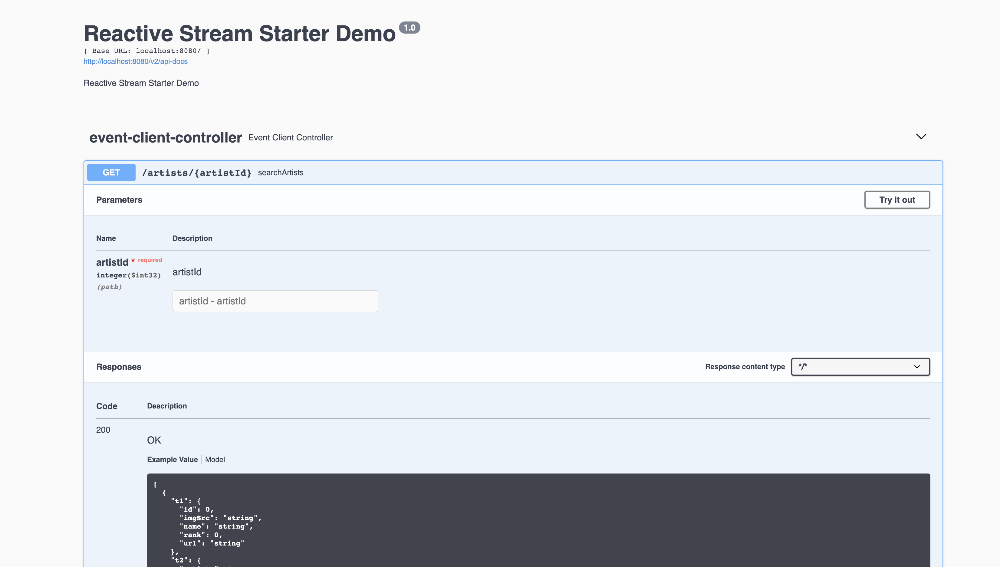

# Sample Reactive - Spring Boot application

The purpose of this project is to demonstrate how we can
use [Spring WebFlux](https://docs.spring.io/spring/docs/current/spring-framework-reference/web-reactive.html) to create
a simple reactive web application.

# How to build n run

project can be compiled with JDK 8 and above `javac`.

To compile just do `mvn clean package`.

## Prerequisites

* JAVA 8 should be installed
* Postgres should be up and running at : <localhost:5432>

To run the application execute the following:

```
java -jar target/reactive-examples*.jar
```

You can also use the Swagger-UI to test the application.


The server will start at <http://localhost:8080>.

## Exploring the Rest APIs

The Swagger UI will open at : <http://localhost:8080/swagger-ui/index.html>

The application contains the following REST APIs

```
1. GET /artists/{artistId} - Get Artist and Associated events

```

It contain a sample WebClient to retrieve data from our User Management application.

sample usage

mvn clean package  

java -jar target/reactive-examples-0.0.1-SNAPSHOT.jar

curl http://localhost:8080/artists/21
[{"t1":{"id":21,"name":"HRH Prog","imgSrc":"//some-base-url/hrh-prog.jpg","url":"/hrh-prog-tickets/artist/21","rank":1},"t2":{"id":1,"title":"Fusion Prog","dateStatus":"singleDate","timeZone":"Europe/London","startDate":"2020-10-17T00:00:00","artists":[{"id":21,"name":null,"imgSrc":null,"url":null,"rank":null},{"id":23,"name":null,"imgSrc":null,"url":null,"rank":null},{"id":26,"name":null,"imgSrc":null,"url":null,"rank":null}],"hiddenFromSearch":false}}]%      